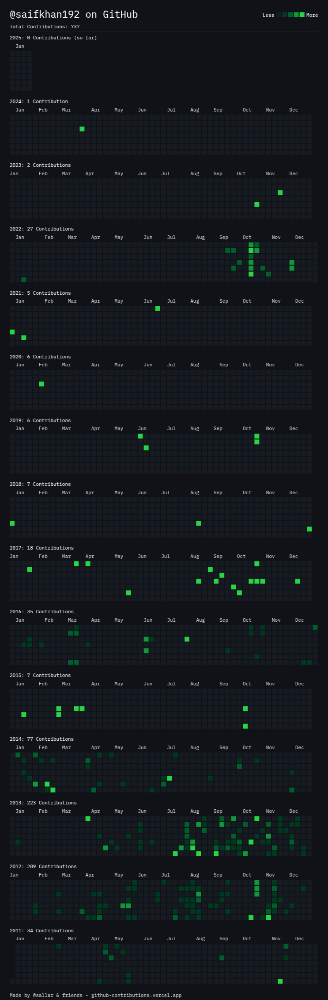

# Software Developer & DevOps Engineer

- 🌱 I’m currently learning everything in Backend Development and Cloud. Big fan of GitHub and open source projects
- 👯 I’m looking to collaborate with other developers, especially for open-source work
- 🥅 2025 Goals: Contribute more to Open Source projects and get at least 3 Cloud Certifications
- ⚡ Fun fact: Travelling

### Follow me here 🤝

### Contribution Graph

### Languages & Tools 🛠

### ✅ Backend

&nbsp;

### ✅ Frontend

### ✅ Databases

### ✅ Cloud Platforms

### ✅ Infrastructure as Code

### ✅ GitOps
&nbsp;

### ✅ CI/CD
&nbsp;

### ✅ Serverless

### ✅ Observability

### ✅ Performance and Load Testing

